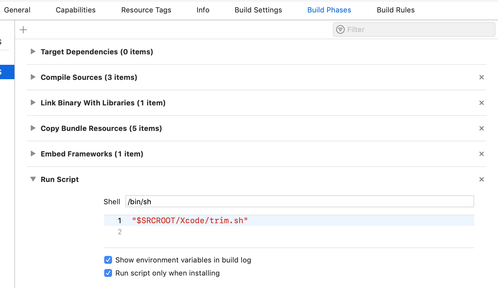

# cordova-plugin-wannatalk-core

## Getting started

`$ ionic cordova plugin add cordova-plugin-wannatalk-core --save`


## iOS Setup
1. Set minimum deployment target under iOS platform in ionic app's config.xml file.
    `<preference name="deployment-target" value="11.0" />`
2. `$ ionic cordova prepare ios`
3. Request **WTService-Info.plist** from [wannatalk.ai](https://wannatalk.ai) and drag it into your iOS application in Xcode. When prompted, select **"Copy items if needed"** and continue.
4. Add below keys in your iOS application's Info.plist

    ```
   <key>NSPhotoLibraryUsageDescription</key>
   <string>To save in-chat photos and videos</string>
   <key>NSContactsUsageDescription</key>
   <string>To locate friends already on the Wannatalk network</string>
   <key>NSCameraUsageDescription</key>
   <string>To take photos and videos to send to friends in-chat</string>
   <key>NSLocationWhenInUseUsageDescription</key>
   <string>To display it in map</string>
   <key>NSMicrophoneUsageDescription</key>
   <string>To record live photos and movies</string>
   ```

5. Run


## Android Setup
1. Set `AndroidXEnabled` under android platform in ionic app's config.xml file.
    `<preference name="AndroidXEnabled" value="true" />`
2. `$ ionic cordova prepare android`    
3. Request **wannatalk-services.json** from [wannatalk.ai](https://wannatalk.ai) and drag it into your android application `assets` directory


4. Set colorPrimary, colorPrimaryDark and colorAccent attributes in app's color.xml (src/main/res/values/colors.xml)
5. Enable `multiDexEnabled` in your application **build.gradle**
   
   ```
   android {
       defaultConfig {
           // Enabling multidex support.
           multiDexEnabled true
       }
       ...
   }
   ```
6. Run!


# Usage
```javascript

import { Component, NgZone } from '@angular/core';
import { NavController, Platform } from 'ionic-angular';

declare var cordova: any;

```

## To Initiate Wannatalk SDK
```typescript

    var sdkSettings = {};
    cordova.plugins.WannatalkCore.initializeSDK(sdkSettings, () => {
      
      console.log("initializeSDK call success");
    }, (result) =>  {
      
      if (result != null) {
        this.showAlert(result);
      }
    });
```

## To link Wannatalk account
```typescript

    let mobileNumber = "+60123123123";
    let userDisplayName = "Test User";

    cordova.plugins.WannatalkCore.silentLogin(mobileNumber, {
      dislpayName: userDisplayName,
    }, () => {
      // success
    }, (err) => {
      // failed: err
    });
```

### To check login status
```typescript

    cordova.plugins.WannatalkCore.isUserLoggedIn((loggedIn) => {
      console.log("isUserLoggedIn :" + loggedIn);
      
      this.zone.run(() => {
        // update ui
        // this.userLoggedIn = loggedIn;
        });      
    }, null);
```

## To unlink Wannatalk account
```typescript

    cordova.plugins.WannatalkCore.logout(() => {
      // logout success
    }, (err) => {
      // logout failed: err
    });
    
```
    
## HelpDesk
### To load your organization profile
```typescript
    cordova.plugins.WannatalkCore.loadOrgProfile((result) => {
      console.log("loadOrgProfile success");
      // loadOrgProfile loaded
    }, (err) => {
      // loadOrgProfile load failed err
    });
```


## To strip simulator architecture framework for your app submission
1. Copy **trim.sh** file into your project folder.
2. Create Run Script Phase in Build Phases of your application target.
3. Paste `"$SRCROOT/trim.sh"` inside the body of Run Script Phase.
4. Enable `Run script only when installing` and `Show environment variables in build log`.

